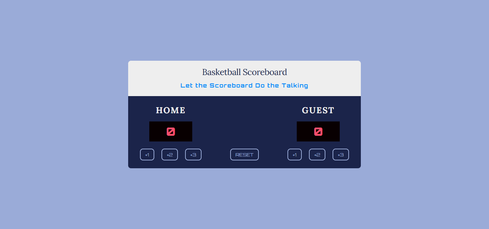
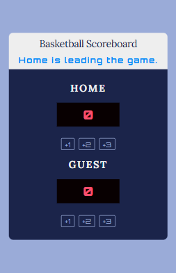

#  🏀 Basketball Scoreboard

A simple and interactive basketball scoreboard built with HTML, CSS, and JavaScript. This is a practice project designed to improve DOM manipulation and event-handling skills in JavaScript.


## 🛰 Live Demo  
🔗 [View Project](https://bhavikthakur.github.io/basketball-scoreboard/)  

## 📸 Preview  
  
   

## 📌 Features  
✅ Real-time Score Updates – Click buttons to update scores dynamically. <br>
✅ Leader Indicator – Displays which team is leading or if the game is tied. <br>
✅ Modern UI Design – Styled with CSS for a clean and responsive look. <br>
✅ Optimized Code Structure – JavaScript handles all updates efficiently. <br>

## 🛠️ Built With  
- **HTML5** - Semantic markup for structure.   <br>
- **CSS3** - Modern styling with a mobile-first approach.  <br>
- **Google Fonts** - Used Lora and Orbitron for typography.    <br>
- **CSS  Media Queries** - Ensured responsiveness for different screen sizes.
- **JavaScript (DOM Manipulation)** - Basic event listener to update the scores
## 📂 Folder Structure  
/project-folder <br>
│── /css <br>
│   ├── reset.css        # Resets default browser styles <br>
│   ├── styles.css       # Main styling file <br>
│   ├── media-queries.css # Responsive styles <br>
│── /images             # Contains all images & icons <br>
│── index.html          # Main HTML file <br>
│── README.md           # Documentation <br>


## 🔧 Setup & Usage  
1. Clone this repository:  
   ```bash
   git clone https://github.com/bhavikthakur/basketball-scoreboard.git    
2. Open index.html in your browser. 

## 🔓 Future enhancement  
🔹 Add a reset button to restart the game. <br>
🔹 Implement a timer feature for a more realistic experience. <br>
🔹 Store scores in localStorage to retain them after refresh. <br>

## 📜 Credit
This is a practice project provided by Scrimba. A great platform for learning purposes. 🚀


## 🤝 Connect With Me  
👨‍💻 GitHub: [bhavikthakur](https://github.com/bhavikthakur)  <br>
💼 LinkedIn: [Bhavik Thakur](https://www.linkedin.com/in/bhavik-thakur/)  <br>
🐦 Twitter: [Bhavik Thakur](https://x.com/BhavikkThakur)  <br>
